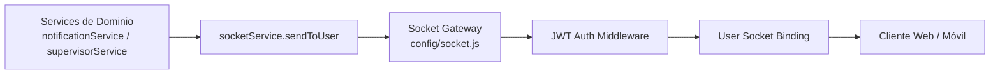

# Platform Creative Backend

Backend API para la plataforma educativa Creative (MERN), con enfoque en seguridad, roles y calidad de ingeniería.

## Arquitectura del Sistema

La API sigue un patron N-Tier con Service-Repository Pattern para separar responsabilidades y facilitar escalabilidad.

Flujo principal:

Request -> Route -> Controller -> Service -> Repository -> MongoDB

- Route: define endpoint, middlewares de auth/validacion y delega al controlador.
- Controller: capa HTTP delgada, transforma request/response y delega en servicios.
- Service: reglas de negocio, casos de uso y orquestacion de seguridad.
- Repository: acceso a datos con Mongoose y consultas optimizadas.
- MongoDB: persistencia de entidades de dominio.

## Requisitos

- Node.js 18+
- npm 9+

## Scripts principales

- `npm start`: inicia el servidor en modo normal.
- `npm run dev`: inicia el servidor con watch.
- `npm run seed`: siembra materias iniciales.
- `npm test`: ejecuta tests con cobertura y umbral mínimo obligatorio.
- `npm run test:watch`: ejecuta tests en modo watch.
- `npm run test:coverage`: genera reporte de cobertura detallado.

## Testing

### Ejecutar tests

```bash
npm test
```

Este comando ejecuta suites unitarias e integraciones del backend.

### Generar reporte de cobertura

```bash
npm run test:coverage
```

Se generan reportes en la carpeta `coverage/`:

- `coverage/lcov-report/index.html`: reporte HTML navegable.
- Resumen en consola (`text-summary`).

### Base de datos de prueba

Los tests de integración usan `mongodb-memory-server`, por lo que no ensucian tu MongoDB Atlas.

### Verificación manual de tiempo real (Socket.io)

```bash
npm run socket:test
```

Este script levanta un cliente Socket.io autenticado y valida recepción de eventos en tiempo real.

### Resumen rápido de comandos de calidad

- `npm test`: unit e integración.
- `npm run test:coverage`: cobertura con umbral mínimo global.
- `npm run socket:test`: chequeo manual realtime.

## Pipeline CI

El workflow de GitHub Actions está en `.github/workflows/node.js.yml` y ejecuta tests en cada `push` o `pull_request` a `main`.

## Sistema de Gamificación

### Rachas diarias (Daily Streaks)

La lógica vive en `services/progressService.js` y se ejecuta al completar una lección por primera vez.

- Si la última actividad fue el mismo día: la racha se mantiene.
- Si la última actividad fue ayer: la racha aumenta en +1.
- Si pasaron más de 48 horas: la racha se reinicia a 1.
- Cuando la racha alcanza un múltiplo de 7, se aplica un bono adicional de 20 puntos.

Campos relacionados en `models/User.js`:

- `lastActivity` (Date)
- `currentStreak` (Number)
- `badges` (Array)

### Medallas automáticas (Badges)

Componentes de la capa:

- Modelo: `models/Badge.js`
- Repositorio: `repositories/badgeRepository.js`
- Servicio: `services/badgeService.js`

Trigger actual:

- Cuando un estudiante completa todas las lecciones de una materia, recibe la medalla `Maestro de [Nombre Materia]`.
- El logro se persiste en `User.badges`.
- Se genera una notificación de logro para seguimiento de padre/madre.

Esta implementación mantiene el patrón por capas Route -> Controller -> Service -> Repository.

## Arquitectura de Tiempo Real

### Flujo de conexión

1. Cliente inicia handshake con Access Token JWT.
2. Middleware de autenticación en sockets valida token.
3. Si es válido, el socket se vincula al usuario conectado (Socket User Binding).
4. Los servicios del backend emiten eventos dirigidos por userId.

### Catálogo de eventos

- `NEW_NOTIFICATION`: evento general de notificaciones al usuario destino.
- `NEW_FEEDBACK`: evento específico para docentes cuando supervisor registra feedback.

### Diagrama de bloques


