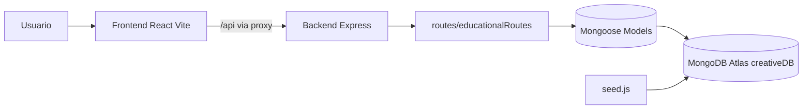

# Platform Creative

Plataforma educativa Full Stack con arquitectura multitemática orientada a primaria.


Taxonomía del dominio:

Materia -> Nivel -> Unidad -> Lección

---

## Tabla de Contenidos / Table of Contents

- [ES - Resumen](#es---resumen)
- [ES - Estado Actual](#es---estado-actual)
- [ES - Arquitectura](#es---arquitectura)
- [ES - Changelog](#es---changelog)
- [ES - API](#es---api)
- [ES - Variables de Entorno](#es---variables-de-entorno)
- [ES - Setup Local](#es---setup-local)
- [ES - Scripts](#es---scripts)
- [ES - Seed y Datos](#es---seed-y-datos)
- [ES - Despliegue](#es---despliegue)
- [ES - Troubleshooting](#es---troubleshooting)
- [EN - Overview](#en---overview)
- [EN - Current Status](#en---current-status)
- [EN - Architecture](#en---architecture)
- [EN - Changelog](#en---changelog)
- [EN - API](#en---api)
- [EN - Environment Variables](#en---environment-variables)
- [EN - Local Setup](#en---local-setup)
- [EN - Scripts](#en---scripts)
- [EN - Seed and Data](#en---seed-and-data)
- [EN - Deployment](#en---deployment)

---

## ES - Resumen

Platform Creative implementa un flujo completo de aprendizaje:

1. Selección de materia.
2. Navegación por niveles.
3. Selección de unidades.
4. Lecciones teóricas y prácticas.
5. Registro de progreso en MongoDB.

Incluye frontend React + Vite, backend Node + Express y persistencia en MongoDB Atlas.

## ES - Estado Actual

- 7 materias activas: Matemáticas, Ciencias, Español, Inglés, Historia, Geografía y Arte.
- Endpoints educativos en [routes/educationalRoutes.js](routes/educationalRoutes.js).
- Home y navegación con estilo dinámico basado en `uiConfig` por materia.
- Lecciones de práctica con `MathTableGenerator` funcional, persistencia local y guardado de progreso.
- Semilla multitemática en [seed.js](seed.js) para base `creativeDB`.

## ES - Arquitectura

### Diagrama General



### Backend

- [server.js](server.js): Express, conexión MongoDB, estáticos y montaje de rutas.
- [routes/educationalRoutes.js](routes/educationalRoutes.js): API educativa.
- Modelos:
  - [models/Subject.js](models/Subject.js)
  - [models/GradeLevel.js](models/GradeLevel.js)
  - [models/Unit.js](models/Unit.js)
  - [models/Lesson.js](models/Lesson.js)
  - [models/User.js](models/User.js)
- [seed.js](seed.js): limpieza y carga de catálogo.

### Frontend

- [src/App.jsx](src/App.jsx): rutas, vistas, estados de carga/error y gamificación.
- [src/services/api.js](src/services/api.js): cliente HTTP.
- [src/main.jsx](src/main.jsx): bootstrap React.
- [vite.config.js](vite.config.js): proxy local `/api` -> `http://localhost:3000`.

## ES - Changelog

- Fase 1: definición de taxonomía pedagógica (Materia -> Nivel -> Unidad -> Lección).
- Fase 2: migración de modelos y limpieza de esquema legacy acoplado.
- Fase 3: implementación de API educativa y endpoint de progreso.
- Fase 4: frontend React con navegación jerárquica, gamificación, persistencia local y feedback visual.
- Preparación de despliegue: base `creativeDB`, seed expandido de 7 materias, documentación y scripts de producción.

## ES - API

Prefijo base: `/api`

- `GET /subjects`
- `GET /subjects/:subjectId/levels`
- `GET /levels/:levelId/units`
- `GET /units/:unitId/lessons`
- `GET /lessons/:id`
- `POST /progress`

Payload de progreso:

```json
{
  "userId": "<id>",
  "lessonId": "<id>",
  "score": 100
}
```

## ES - Variables de Entorno

Configura [ .env ](.env):

- `MONGODB_URI` (debe apuntar a `/creativeDB`)
- `JWT_SECRET`
- `PORT`
- `SITE_URL` (recomendado)
- `NODE_ENV` (`development` o `production`)

Documento auxiliar: [REPLY_ME_VARS.txt](REPLY_ME_VARS.txt).

## ES - Setup Local

1. Clonar:

```bash
git clone https://github.com/andresforero1033/platform-creative.git
cd platform-creative
```

2. Instalar:

```bash
npm install
```

3. Configurar `.env`:

```env
MONGODB_URI=mongodb+srv://<user>:<pass>@<cluster>.mongodb.net/creativeDB?retryWrites=true&w=majority&appName=<app>
JWT_SECRET=<tu_secret>
PORT=3000
SITE_URL=http://localhost:5173
NODE_ENV=development
```

4. Sembrar datos:

```bash
node seed.js
```

5. Levantar backend y frontend:

```bash
npm run dev:api
```

```bash
npm run dev
```

6. Abrir:

- Frontend: `http://localhost:5173`
- API: `http://localhost:3000/api/subjects`

## ES - Scripts

- `npm start` -> backend producción (`server.js`)
- `npm run dev:api` -> backend con nodemon
- `npm run dev` -> Vite
- `npm run build` -> build frontend
- `npm run preview` -> preview frontend
- `npm test` -> pruebas Jest

## ES - Seed y Datos

- El seed intenta `dropDatabase`.
- Si Atlas no permite `dropDatabase` por permisos, continúa con `deleteMany` (fallback seguro).
- Resultado esperado después de `node seed.js`:
  - 7 materias
  - al menos 1 nivel por materia
  - al menos 1 unidad por materia
  - lecciones `theory` por materia
  - lección `practice` de tabla del 7 en Matemáticas

## ES - Despliegue

### Render (recomendado)

Variables:

- `MONGODB_URI` -> `.../creativeDB...`
- `JWT_SECRET`
- `PORT`
- `SITE_URL`
- `NODE_ENV=production`

Comandos:

- Build: `npm run build`
- Start: `npm start`

Si necesitas repoblar producción:

```bash
node seed.js
```

## ES - Troubleshooting

- API vacía: ejecutar `node seed.js` y revisar `MONGODB_URI`.
- Proxy Vite: validar [vite.config.js](vite.config.js).
- Error Atlas `dropDatabase`: esperado con roles limitados, el fallback limpia colecciones.
- CORS local: consumir vía `/api` desde frontend.

---

## EN - Overview

Platform Creative is a full-stack educational platform built around a strict learning hierarchy:

Subject -> Grade Level -> Unit -> Lesson

It currently provides an end-to-end user flow from subject selection to lesson progress tracking.

## EN - Current Status

- 7 active subjects in the catalog.
- Educational API endpoints implemented and connected.
- Dynamic UI themed by subject `uiConfig`.
- Practice lessons powered by a working multiplication generator.
- Local progress persistence + server-side progress saving.
- Multi-subject seed script targeting `creativeDB`.

## EN - Architecture

### Backend

- [server.js](server.js): Express server and route mounting.
- [routes/educationalRoutes.js](routes/educationalRoutes.js): educational endpoints.
- Mongoose models in [models/Subject.js](models/Subject.js), [models/GradeLevel.js](models/GradeLevel.js), [models/Unit.js](models/Unit.js), [models/Lesson.js](models/Lesson.js), [models/User.js](models/User.js).
- [seed.js](seed.js): database seeding logic.

### Frontend

- [src/App.jsx](src/App.jsx): routing, page logic, loading/error states, gamification.
- [src/services/api.js](src/services/api.js): Axios service layer.
- [vite.config.js](vite.config.js): local API proxy.

## EN - Changelog

- Phase 1: pedagogical taxonomy defined (Subject -> Grade Level -> Unit -> Lesson).
- Phase 2: model migration and legacy cleanup.
- Phase 3: educational API and progress endpoint implemented.
- Phase 4: React frontend with hierarchical routing, gamification, local persistence, and UX feedback.
- Deployment readiness: `creativeDB`, expanded seed with 7 subjects, and production-ready documentation/scripts.

## EN - API

Base prefix: `/api`

- `GET /subjects`
- `GET /subjects/:subjectId/levels`
- `GET /levels/:levelId/units`
- `GET /units/:unitId/lessons`
- `GET /lessons/:id`
- `POST /progress`

## EN - Environment Variables

Required:

- `MONGODB_URI` (must target `/creativeDB`)
- `JWT_SECRET`
- `PORT`

Recommended:

- `SITE_URL`
- `NODE_ENV`

Reference checklist: [REPLY_ME_VARS.txt](REPLY_ME_VARS.txt).

## EN - Local Setup

```bash
git clone https://github.com/andresforero1033/platform-creative.git
cd platform-creative
npm install
node seed.js
npm run dev:api
npm run dev
```

Open:

- `http://localhost:5173`
- `http://localhost:3000/api/subjects`

## EN - Scripts

- `npm start` -> production backend
- `npm run dev:api` -> backend with nodemon
- `npm run dev` -> Vite dev server
- `npm run build` -> frontend build
- `npm run preview` -> frontend preview
- `npm test` -> Jest tests

## EN - Seed and Data

The seed attempts `dropDatabase` first. If Atlas permissions do not allow it, the script safely falls back to collection cleanup using `deleteMany`.

## EN - Deployment

Use these defaults in your hosting provider:

- Build command: `npm run build`
- Start command: `npm start`
- Env vars: `MONGODB_URI`, `JWT_SECRET`, `PORT`, `SITE_URL`, `NODE_ENV`

After successful deploy, run:

```bash
node seed.js
```

---

## Postman Collection

[postman/creative-platform-fase3.postman_collection.json](postman/creative-platform-fase3.postman_collection.json)

## License

MIT
